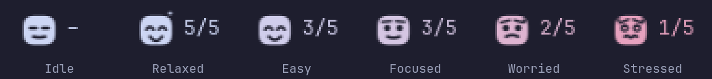
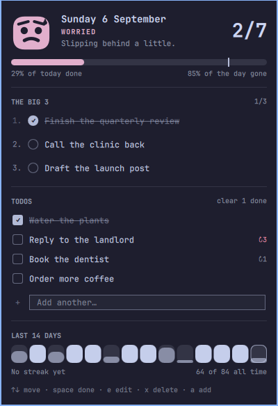

# Daily Todos

An [Omarchy](https://omarchy.org/) shell plugin: three things that matter, a
day progress bar, and a mascot in the bar who reacts to how the day is going.



Pip is the ambient bit. You do not read a number to know how the day is going;
you glance at a face. Nothing done at 6pm looks like nothing done at 6pm.

## Install

```bash
omarchy plugin add https://github.com/Saikomantisu/omarchy-todos.git --enable --yes
omarchy bar move io.github.saikomantisu.todos --after omarchy.clock
```

Plugins run as unsandboxed code inside `omarchy-shell`, so read the source
first — it is five QML files and a JS module, and it is meant to be read.

### Removing it

```bash
omarchy plugin remove io.github.saikomantisu.todos --yes
```

That takes the widget out of the bar and deletes the plugin. Your history is
deliberately left behind, so reinstalling picks up where you left off. To
delete that too:

```bash
rm -rf ~/.local/share/omarchy-todos
```

### Requirements

Omarchy with the Quickshell-based shell (`omarchy-shell`). Nothing else — no
runtime, no daemon, no account, no network access. The only external commands
it ever runs are `mkdir` (to create its own data directory) and Omarchy's own
`omarchy-notification-send`, used once a day at most to tell you what got
carried over. It writes to exactly one path,
`~/.local/share/omarchy-todos/`, plus its own entry in `shell.json` when you
right-click the widget to toggle the count.

## The bar widget

Pip sits in the bar with `done/total` beside them. That is all the bar gets —
the numbers live in the panel; the bar is for the face.

| Click  | Does                                              |
|--------|---------------------------------------------------|
| left   | open the day panel                                |
| right  | show/hide the `done/total` count                  |
| middle | open the panel with the add field already focused |

## Pip's moods

The face comes from two numbers: how much of the day's work is done (Big 3
items count double) and how much of your working window has elapsed. The gap
between them is the mood.

| Mood      | When                          | Face                                         |
|-----------|-------------------------------|----------------------------------------------|
| Idle      | nothing planned               | flat eyes, small mouth                       |
| Relaxed   | everything done               | closed happy eyes, big grin, sparkles        |
| Easy      | comfortably ahead (gap < 15%) | happy eyes, wide smile                       |
| Focused   | on pace (gap < 35%)           | open eyes, slight smile                      |
| Worried   | slipping (gap < 60%)          | tilted brows, frown, one sweat drop          |
| Stressed  | a lot of day gone (gap ≥ 60%) | wide eyes, squiggle mouth, two drops, fidget |

Stress also shifts Pip's colour from your theme's foreground toward its urgent
colour, so the mood lands before you have parsed the face.

Pip is drawn, not shipped as an image: a solid silhouette with the features
punched out of it. Outlined faces turn to mud at 19px; negative space does
not. That means Pip follows your theme, and is the same character at bar size
and at panel size.

## The panel



- **Hero** — Pip at full size, the date, the mood, today's count.
- **Progress** — the day's bar. The fill is completed-over-planned; the marker
  is where the clock says you should be. The gap between them is what Pip is
  reacting to.
- **The Big 3** — three slots, capped. The next free slot *is* the input.
- **Todos** — everything else, with `clear N done` in the section header.
- **Last 14 days** — a bar per day, today outlined, plus streak and all-time.

Rows: click to toggle, right-click or double-click to edit, hover for
promote/demote (`▴`/`▾`) and delete (`✕`). A todo carried more than once wears
a `↻N` badge, and it turns urgent-coloured at three — a task that keeps
sliding should be visible, not quietly accumulating.

Keyboard: `↑↓`/`jk` move · `space`/`enter` toggle · `e` edit · `←→`/`hl` move
between the Big 3 and the rest · `J`/`K` reorder · `x` delete · `a` add a todo ·
`b` add to the Big 3 · `c` clear completed · `esc` close.

## Carry-over

At midnight — or on the first launch after the machine has been off — today is
built from the most recent day on record:

- unfinished **Big 3** items come across as **regular todos**. They had their
  shot at being one of the three; today's three are chosen fresh.
- unfinished regular todos come across as they were;
- completed items stay on the day they were completed.

Past days are never rewritten, so the file is the history: a missed todo stays
missed on the day it was missed and is *copied* forward, with `carries`
counting the mornings it has survived.

## Keybinds and scripting

The plugin registers an IPC target, so anything can drive it:

```bash
omarchy-shell io.github.saikomantisu.todos status              # "2/7 Worried"
omarchy-shell io.github.saikomantisu.todos add "Water plants"
omarchy-shell io.github.saikomantisu.todos big3 "Ship the thing"
omarchy-shell io.github.saikomantisu.todos toggle              # panel
omarchy-shell io.github.saikomantisu.todos capture             # panel, focused on the add field
```

`capture` is the one worth binding — in `~/.config/hypr/bindings.lua`:

```lua
o.bind("SUPER", "T", "omarchy-shell io.github.saikomantisu.todos capture")
```

## Settings

Inline on the widget's entry in `~/.config/omarchy/shell.json`:

```json
{ "id": "io.github.saikomantisu.todos", "dayStart": 8, "dayEnd": 22, "showCount": true }
```

`dayStart` / `dayEnd` are the working window progress is judged against.
Nobody is behind schedule at 6am and everybody is out of road at 11pm, so
measuring against midnight would make the mascot lie in both directions.

## Your data

Everything lives in one local file, `~/.local/share/omarchy-todos/history.json`.
Nothing is uploaded and there is no account. Days are kept for 400 days.

```json
{
  "version": 1,
  "days": {
    "2026-09-06": {
      "date": "2026-09-06",
      "big3":  [ { "id": "…", "text": "…", "done": true, "completedAt": "…" } ],
      "todos": [ { "id": "…", "text": "…", "done": false, "carries": 3 } ]
    }
  }
}
```

It is plain JSON and safe to edit by hand or generate from a script — write it
atomically (write beside it, then rename) so the plugin never sees a half-file.
If it does see a torn or unparseable file it keeps the state it already has and
refuses to write over it, rather than adopting an empty day.

## Layout

- `Model.js` — pure day/todo math: parsing, carry-over, stats, moods, history.
  Qt-free, so it can be exercised straight from node.
- `Store.qml` — the file, the clock, and the mutations. One per bar instance;
  they share state through the file, so edits show up on every monitor.
- `Mascot.qml` — Pip.
- `BarWidget.qml` — mascot, count, IPC, panel host.
- `Panel.qml` — the day view.

Saving any file under `~/.config/omarchy/plugins/` hot-reloads it. Stale
generations can linger, so `omarchy restart shell` is the honest way to test a
change.

## Licence

MIT — see [LICENSE](LICENSE).
